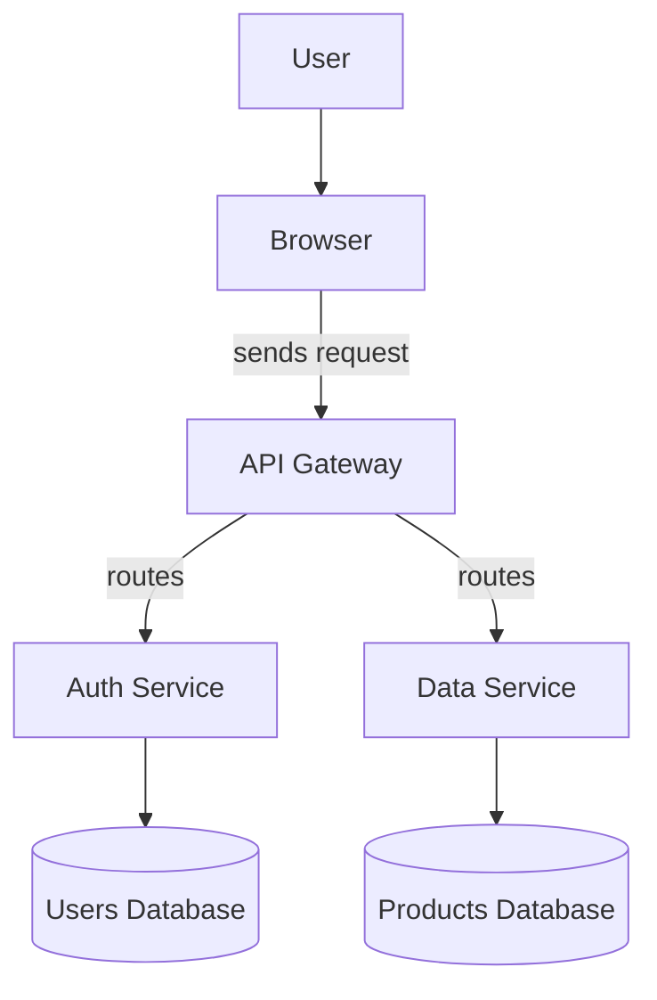
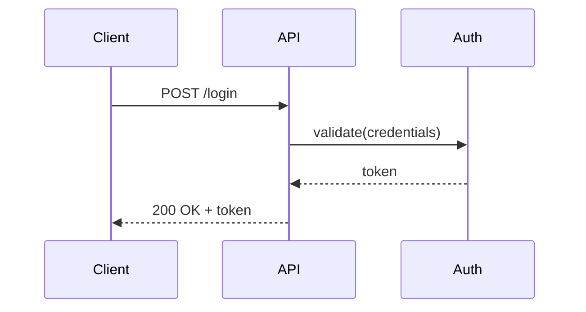
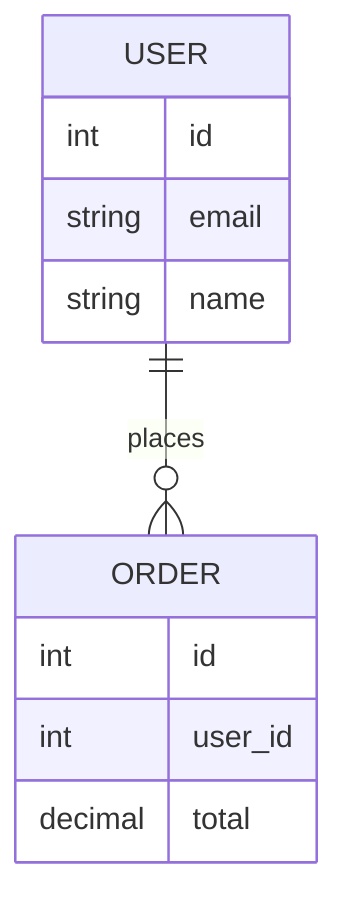

import { Aside } from '@astrojs/starlight/components';

Diagram Generator creates architecture and flow diagrams using [Mermaid.js](https://mermaid.js.org/). You can describe the diagram in plain English, start from a template, or build it visually.


## Three Input Modes

### 1. Text (NLP)
Describe your system in plain English. The tool extracts entities and connections.

**Input:**
```
User sends request from Browser to API Gateway.
API Gateway routes to Auth Service and Data Service.
Auth Service reads from Users Database.
Data Service reads from Products Database.
```

**Generated Mermaid:**


### 2. Templates
Browse 25+ pre-built templates organized by category:

| Category | Templates include |
|----------|------------------|
| **Architecture** | Microservices, Multi-cloud, Serverless, CDN + Cache |
| **Flow** | User registration, Checkout flow, CI/CD pipeline |
| **DevOps** | Kubernetes pod lifecycle, Docker build pipeline |
| **Database** | Read replica setup, Migration flow |
| **Security** | OAuth2 flow, Zero-trust network |

Click any template to load it into the editor — then customize the nodes and labels.

### 3. Visual Editor
Add nodes and edges with a point-and-click interface:

**Node types:**
- User / Client
- Service / API
- Database
- Queue / Message bus
- Storage / Blob
- External system

**Edge configuration:** from node → to node, with an optional label.

After building the graph visually, switch to the **Code** tab to see the generated Mermaid syntax and edit it directly.

## Diagram Types

The tool outputs `graph TD` (top-down flowchart) by default, but the Mermaid editor tab lets you switch to any type:





## Export

| Format | How |
|--------|-----|
| **PNG** | Click **Download PNG** — white background, 2× resolution |
| **SVG** | Click **Download SVG** — transparent background, scalable |
| **Copy PNG** | Copies the image to clipboard for pasting into Notion, Confluence, etc. |

## History

Click **Save** to persist the current diagram to browser localStorage. Saved diagrams appear in the **History** panel with timestamps — click any entry to restore it.

<Aside type="tip">
Switch to the **Code** tab at any time to edit the Mermaid syntax directly. The preview updates live as you type.
</Aside>

<Aside type="tip">
Click a rendered diagram to open it in a **zoom modal** — useful for large diagrams that don't fit on screen.
</Aside>

## Related Tools

- [Markdown Preview](tools/markdown-preview) — embed Mermaid diagrams inside Markdown documents
