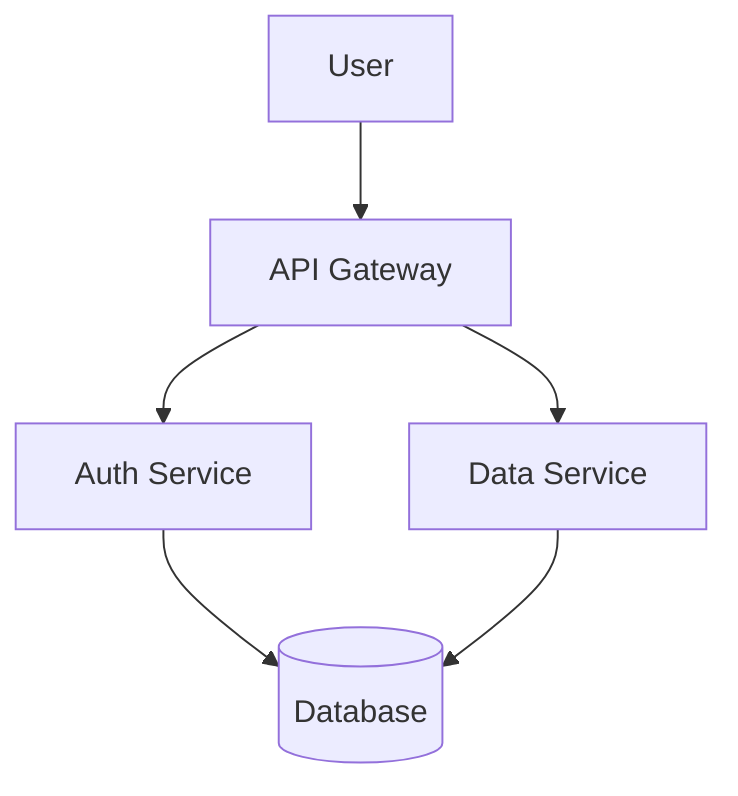
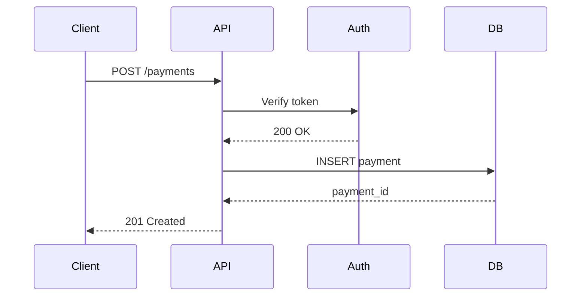

import { Aside } from '@astrojs/starlight/components';

Markdown Preview is a full-featured GFM editor with real-time rendering, Mermaid diagrams embedded in code blocks, and export to HTML or PDF.

## View Modes

| Mode | Shortcut | Description |
|------|----------|-------------|
| **Editor only** | — | Focus on writing |
| **Split** | — | Editor left, preview right (default) |
| **Preview only** | — | Full-width rendered output |

Click the icons in the top-right to switch modes.

## Supported Markdown Features (GFM)

- Headings (`# H1` through `###### H6`)
- **Bold** (`**text**`), *italic* (`*text*`), ~~strikethrough~~ (`~~text~~`)
- Unordered lists (`- item`), ordered lists (`1. item`)
- Task lists (`- [x] done` / `- [ ] todo`)
- Code blocks with language identifier (` ```js `)
- Inline code (`` `code` ``)
- Links (`[label](url)`) and images (``)
- Tables with alignment
- Blockquotes (`> quote`)
- Horizontal rules (`---`)

## Mermaid Diagrams

Use a fenced code block with `mermaid` as the language to embed a rendered diagram:

````markdown

````

This renders as an interactive diagram in the preview. Click the diagram to open it in a zoom modal with download options (PNG, SVG).

### Mermaid diagram types supported
- `graph` / `flowchart` — flowcharts
- `sequenceDiagram` — sequence diagrams
- `classDiagram` — UML class diagrams
- `stateDiagram-v2` — state machines
- `erDiagram` — entity-relationship diagrams
- `gantt` — Gantt charts
- `pie` — pie charts

## Export

| Export | What it produces |
|--------|-----------------|
| **Export HTML** | Downloads a standalone `.html` file with embedded styles |
| **Export PDF** | Opens the browser print dialog (use "Save as PDF") |

## Live Stats

The status bar shows real-time word count, character count, and line count.

## Example: Full document

```markdown
# API Reference

Welcome to the **Payments API** documentation.

## Endpoints

| Method | Path | Description |
|--------|------|-------------|
| GET | `/payments` | List all payments |
| POST | `/payments` | Create a payment |
| GET | `/payments/{id}` | Get one payment |

## Authentication

All requests require a Bearer token in the `Authorization` header:

```http
Authorization: Bearer <your-token>
```

## Flow


```

<Aside type="tip">
Import an existing `.md` file using the file picker button. The editor loads the content instantly, ready for editing and live preview.
</Aside>

## Related Tools

- [Diagram Generator](/tools/diagram-generator) — generate Mermaid diagrams from plain English
- [Text Compare](/tools/text-compare) — diff two markdown documents
